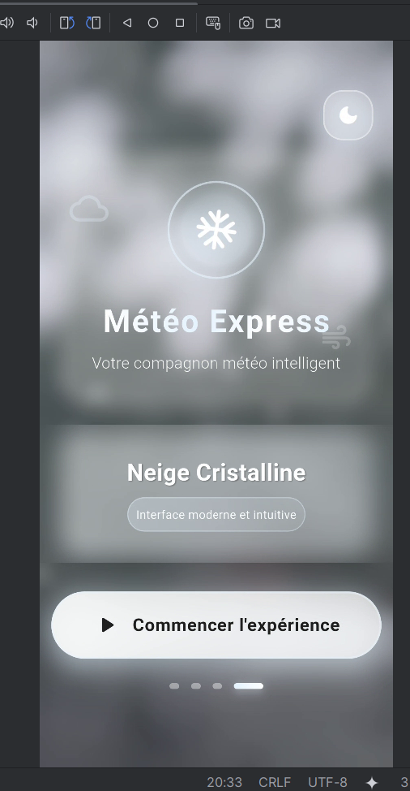
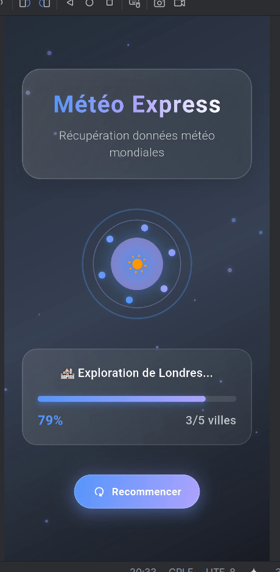
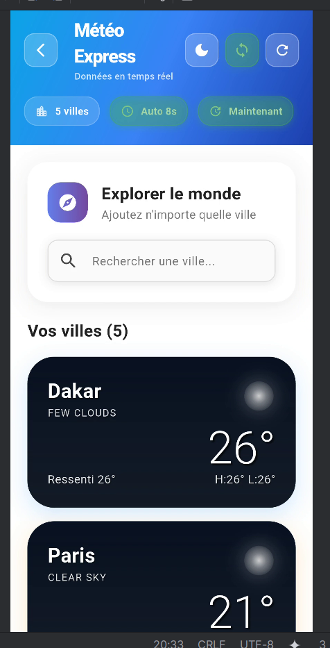
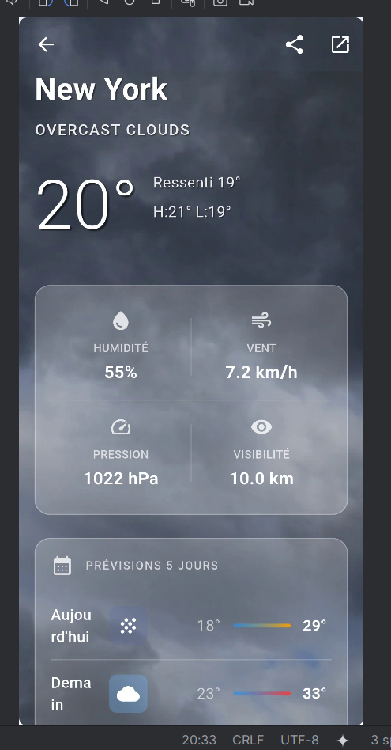
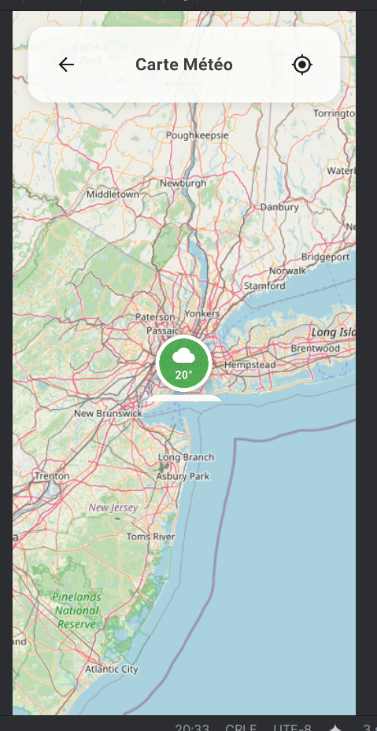
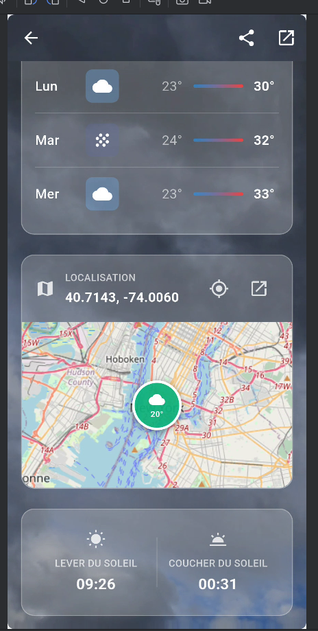

# weather_app

# 🌤️ Météo Express - Application Flutter

Une application météo moderne et élégante développée avec Flutter, offrant des données météorologiques en temps réel avec une interface utilisateur immersive, des animations fluides et un système de couleurs professionnel.


## 📋 Table des Matières

- [✨ Fonctionnalités](#-fonctionnalités)
- [🏗️ Architecture](#️-architecture)
- [🛠️ Technologies Utilisées](#️-technologies-utilisées)
- [🎨 Système de Design](#-système-de-design)
- [🚀 Installation](#-installation)
- [🎯 Utilisation](#-utilisation)
- [📱 Screenshots](#-screenshots)
- [🔧 Configuration](#-configuration)
- [👥 Équipe](#-équipe)

## ✨ Fonctionnalités

### 🏠 Écran d'Accueil Immersif
- **Vidéos d'arrière-plan dynamiques** selon les conditions météo
- **Animations de particules** interactives avec effet glassmorphism
- **Carrousel automatique** présentant différents types de météo
- **Switch thème jour/nuit** avec transitions fluides
- **Logo personnalisé** de l'application avec animations

### 📊 Écran de Chargement Animé
- **Jauge de progression** avec animations circulaires
- **Récupération séquentielle** des données météo pour 5 villes
- **Messages dynamiques** de progression
- **Animations de particules** flottantes et étoiles scintillantes
- **Bouton recommencer** permanent pour relancer l'expérience

### 🌍 Dashboard Météo Principal
- **Auto-refresh intelligent** - mise à jour cyclique toutes les 8 secondes
- **Recherche de villes mondiale** avec API Nominatim (OpenStreetMap)
- **Cartes météo interactives** avec arrière-plans vidéo dynamiques
- **Gestion avancée** - ajout/suppression de villes (max 8)
- **Indicateurs en temps réel** - statut auto-sync, compteur villes, dernière MAJ
- **Interface adaptative** - couleurs qui s'adaptent automatiquement au thème

### 🔍 Détails Météo Complets
- **Informations détaillées** - température, ressenti, humidité, vent, pression
- **Prévisions 5 jours** avec API OpenWeather et gradients de température
- **Carte interactive** OpenStreetMap avec marqueurs colorés par température
- **Arrière-plans adaptatifs** jour/nuit selon l'heure locale
- **Données solaires** - lever/coucher du soleil
- **Couleurs contextuelles** - marqueurs et barres de température intelligents

### 🎨 Design & UX
- **Système de couleurs centralisé** avec AppColors
- **Thème adaptatif** - mode sombre/clair avec cohérence totale
- **Animations fluides** - transitions, stagger effects, micro-interactions
- **Interface responsive** - s'adapte à toutes les tailles d'écran
- **Glassmorphism** et effets visuels modernes
- **Feedback utilisateur** - SnackBars colorés, loading states, error handling
- **Cohérence visuelle** - gradients météo uniformes dans toute l'app

## 🏗️ Architecture

L'application suit les principes de **Clean Architecture** avec une séparation claire des responsabilités et un système de design professionnel :

```
lib/
├── 📁 api/                     # Couche d'accès aux données
│   ├── api_client.dart         # Client API centralisé
│   ├── weather_api.dart        # Interface Retrofit OpenWeather
│   └── weather_api.g.dart      # Code généré Retrofit
│
├── 📁 models/                  # Modèles de données
│   ├── weather.dart           # Modèle météo principal
│   ├── forecast_response.dart  # Réponse prévisions 5 jours
│   ├── daily_forecast.dart    # Prévision journalière
│   └── [autres modèles]       # Coord, Wind, Clouds, etc.
│
├── 📁 services/               # Couche logique métier
│   ├── real_weather_service.dart        # Service météo principal
│   ├── forecast_service.dart            # Service prévisions
│   ├── nominatim_search_service.dart    # Recherche géographique
│   ├── dynamic_weather_background_service.dart # Arrière-plans dynamiques
│   └── weather_video_service.dart       # Gestion vidéos météo
│
├── 📁 screens/                # Écrans de l'application
│   ├── welcome_screen.dart              # Écran d'accueil
│   ├── loading_screen.dart              # Écran de chargement
│   ├── home_screen.dart                 # Dashboard principal
│   ├── weather_detail_screen.dart       # Détails météo
│   └── full_screen_weather_map_screen.dart # Carte plein écran
│
├── 📁 widgets/                # Composants réutilisables
│   ├── 📁 common/
│   │   ├── custom_button.dart           # Boutons standardisés
│   │   └── custom_chip.dart             # Chips d'information
│   ├── 📁 header/
│   │   └── header_widget.dart           # En-tête de l'app
│   ├── 📁 weather/
│   │   └── weather_card_widget.dart     # Cartes météo
│   ├── city_search_widget.dart          # Widget de recherche
│   └── [autres widgets]                # Composants spécialisés
│
├── 📁 themes/                 # 🎨 Système de design centralisé
│   ├── app_theme.dart         # Thèmes clair/sombre
│   └── app_colors.dart        # Palette de couleurs complète
│
└── main.dart                  # Point d'entrée de l'application
```

### 🎯 Patterns Architecturaux Utilisés

- **Clean Architecture** - Séparation Data/Domain/Presentation
- **Repository Pattern** - Abstraction de l'accès aux données
- **Factory Pattern** - CustomButtonFactory, CustomChipFactory
- **Provider Pattern** - Gestion d'état globale pour les thèmes
- **Service Layer** - Logique métier encapsulée
- **Centralized Design System** - Couleurs et styles unifiés

## 🎨 Système de Design

### 🌈 Palette de Couleurs Centralisée

L'application utilise un système de couleurs professionnel avec `AppColors` :

```dart
// Couleurs principales
static const Color primaryBlue = Color(0xFF667EEA);
static const Color primaryPurple = Color(0xFF764BA2);
static const Color brightBlue = Color(0xFF5896FD);
static const Color softViolet = Color(0xFFB0A4FF);

// Couleurs sémantiques
static const Color success = Color(0xFF10B981);
static const Color warning = Color(0xFFF59E0B);
static const Color error = Color(0xFFEF4444);
static const Color info = Color(0xFF3B82F6);

// Couleurs météo
static const Color sunny = Color(0xFFFFB75E);
static const Color cloudy = Color(0xFF74B9FF);
static const Color rainy = Color(0xFF636FA4);
static const Color snowy = Color(0xFFE6F3FF);
```

### 🎯 Couleurs Adaptatives

```dart
// Couleurs qui s'adaptent automatiquement au thème
static Color surface(BuildContext context);
static Color onSurface(BuildContext context);
static Color cardBackground(BuildContext context);
static Color subtleText(BuildContext context);
```

### 🌡️ Gradients Météo Intelligents

```dart
// Méthodes utilitaires pour cohérence visuelle
static List<Color> getWeatherGradient(String weatherMain);
static Color getTemperatureColor(double temperature);
```

### ✨ Avantages du Système Centralisé

- **🎯 Cohérence totale** - Même couleur pour même condition météo partout
- **🔧 Maintenance facilitée** - Changer une couleur dans un seul fichier
- **🌙 Thèmes adaptatifs** - Basculement automatique clair/sombre
- **📱 Code professionnel** - Organisation claire et maintenable
- **🚀 Évolutivité** - Facile d'ajouter de nouvelles couleurs

## 🛠️ Technologies Utilisées

### 🔧 Framework & Langage
- **Flutter 3.x** - Framework de développement cross-platform
- **Dart** - Langage de programmation

### 🌐 APIs & Services
- **OpenWeatherMap API** - Données météorologiques en temps réel
- **Nominatim API** - Géocodage et recherche de lieux (OpenStreetMap)

### 📦 Packages Principaux
```yaml
dependencies:
  flutter:
    sdk: flutter
  
  # 🔄 Gestion d'état
  provider: ^6.1.1
  
  # 🌐 Réseau & API
  dio: ^5.3.2
  retrofit: ^4.0.3
  json_annotation: ^4.8.1
  
  # 🗺️ Cartes
  flutter_map: ^6.1.0
  latlong2: ^0.8.1
  
  # 🎬 Média
  video_player: ^2.7.2
  chewie: ^1.7.0
  
  # 🎨 UI & Animations
  visibility_detector: ^0.4.0
  url_launcher: ^6.2.1

dev_dependencies:
  # 🏗️ Génération de code
  build_runner: ^2.4.7
  retrofit_generator: ^8.0.4
  json_serializable: ^6.7.1
  
  # ✅ Tests & Qualité
  flutter_test:
    sdk: flutter
  flutter_lints: ^3.0.1
```

### 🎨 Fonctionnalités UI/UX
- **Animations personnalisées** avec AnimationController
- **Vidéos d'arrière-plan** adaptatives selon la météo
- **Effets de particules** et animations de nuit
- **Glassmorphism** et design moderne
- **Responsive design** multi-plateforme
- **Système de couleurs centralisé** professionnel

## 🚀 Installation

### 📋 Prérequis
- Flutter SDK 3.x
- Dart 3.x
- Android Studio / VS Code
- Clé API OpenWeatherMap

### 🔧 Installation
1. **Cloner le projet**
```bash
git clone [URL_DU_PROJET]
cd weather_app
```

2. **Installer les dépendances**
```bash
flutter pub get
```

3. **Générer le code**
```bash
flutter packages pub run build_runner build
```

4. **Configuration API**
   - ✅ **Clé API déjà configurée** pour les tests
   - La clé actuelle permet 1000 appels/jour gratuits
   - Pour production, obtenez votre propre clé sur [OpenWeatherMap](https://openweathermap.org/api)
   - Modifiez si nécessaire dans `lib/services/real_weather_service.dart` :
   ```dart
   static const String _apiKey = '4b593112a5b07b5fff0c7f2be4a320ff';
   ```

5. **Logo de l'application**
   - ✅ **Logo personnalisé** déjà intégré
   - Fichiers d'icônes générés pour Android et iOS
   - Design cohérent avec la charte graphique de l'app

6. **Lancer l'application**
```bash
flutter run
```

## 🎯 Utilisation

### 🏠 Démarrage
1. **Écran d'accueil** - Appuyez sur "Commencer l'expérience"
2. **Chargement** - Regardez la progression automatique avec animations
3. **Dashboard** - Explorez les 5 villes pré-chargées avec couleurs cohérentes

### 🔍 Fonctionnalités Principales
- **🔄 Auto-refresh** - Basculez avec le bouton de synchronisation
- **🌍 Ajouter une ville** - Utilisez la barre de recherche intelligente
- **📱 Détails** - Appuyez sur une carte météo pour voir les prévisions
- **🗑️ Supprimer** - Appui long sur une carte avec dialogue de confirmation
- **🌙 Thème** - Bouton en haut à droite avec basculement fluide
- **🎨 Couleurs** - Observez la cohérence visuelle dans tous les écrans

### 🎮 Contrôles
- **Tap** - Voir les détails d'une ville avec carte interactive
- **Long press** - Supprimer une ville avec confirmation élégante
- **Pull to refresh** - Actualiser manuellement avec feedback visuel
- **Swipe** - Navigation fluide entre les écrans
- **Theme toggle** - Basculement instantané avec préservation des couleurs

## 📱 Screenshots

## 📱 Screenshots

### 🏠 Écran d'Accueil avec Logo Personnalisé

*Interface immersive avec vidéos d'arrière-plan et logo personnalisé*

### ⏳ Animation de Chargement

*Progression animée avec récupération des données météo*

### 📊 Dashboard Principal avec Couleurs Cohérentes

*Cartes météo interactives avec système de couleurs centralisé*

### 🔍 Détails Météo Complets

*Informations détaillées avec prévisions 5 jours et carte interactive*

### 🗺️ Carte Interactive Plein Écran

*Localisation précise avec marqueurs colorés par température*

### 🎨 Mode Sombre/Clair

*Adaptation automatique des couleurs selon le thème*

## 🔧 Configuration

### 🌡️ Villes par Défaut
L'application charge automatiquement 5 villes avec couleurs distinctives :
- 🇸🇳 Dakar (Orange soleil)
- 🇫🇷 Paris (Bleu info)
- 🇬🇧 Londres (Bleu nuageux)
- 🇺🇸 New York (Vert succès)
- 🇯🇵 Tokyo (Orange warning)

### ⚙️ Paramètres Configurables
```dart
// Intervalle de mise à jour automatique
const Duration(seconds: 8)

// Nombre maximum de villes
const int maxCities = 8;

// Unités de température
const String units = 'metric'; // Celsius

// Couleurs météo centralisées
AppColors.getWeatherGradient('clear'); // Gradient soleil
AppColors.getTemperatureColor(25.0);   // Couleur selon température
```

### 🎨 Personnalisation Avancée
- **Thèmes** : Modifiez `lib/themes/app_theme.dart`
- **Couleurs** : Centralisées dans `lib/themes/app_colors.dart`
- **Animations** : Durées configurables dans chaque screen
- **Gradients météo** : Ajoutez facilement de nouvelles conditions
- **Logo** : Remplacez les fichiers dans `android/app/src/main/res/`

## 👥 Équipe

**Développé par :** Mamadou SY  
**Formation :** L3 DAR/ESMT 2025  
**Projet :** Examen de Développement Mobile Flutter

### 🏆 Réalisations Techniques

- ✅ **Architecture Clean** avec séparation des responsabilités
- ✅ **Système de couleurs professionnel** centralisé
- ✅ **Refactorisation complète** pour éliminer le code dupliqué
- ✅ **Design cohérent** avec thèmes adaptatifs
- ✅ **Animations fluides** et micro-interactions
- ✅ **Logo personnalisé** intégré
- ✅ **Code maintenable** et évolutif

## 📄 Licence

Ce projet est développé dans le cadre d'un projet académique pour l'ESMT - École Supérieure Multinationale des Télécommunications.

---

## 🎯 Fonctionnalités Techniques Avancées

### 🎨 Système de Design Centralisé
- **AppColors** - Palette complète avec couleurs sémantiques
- **Couleurs adaptatives** - Changement automatique selon le thème
- **Gradients météo** - Cohérence visuelle dans toute l'app
- **Température intelligente** - Couleurs contextuelles selon valeur

### 🔄 Auto-Refresh Intelligent
- Rotation cyclique des villes toutes les 8 secondes
- Mise à jour silencieuse en arrière-plan
- Indicateurs visuels colorés des mises à jour
- Feedback utilisateur avec SnackBars colorés

### 🌐 Recherche Géographique
- API Nominatim pour une recherche mondiale
- Déduplication automatique des résultats
- Tri par pertinence et importance
- Interface de recherche adaptative

### 🎬 Arrière-plans Dynamiques
- Vidéos adaptatives selon la météo
- Fallback sur gradients centralisés si vidéo indisponible
- Détection jour/nuit avec animations spéciales
- Couleurs cohérentes entre vidéos et cartes

### 📊 Gestion d'État Optimisée
- Provider pour les thèmes globaux
- State local pour chaque composant
- Timers et animations bien gérés
- Couleurs réactives au changement de thème

### 🎨 Animations Fluides
- Stagger effects pour les listes avec couleurs graduelles
- Transitions entre écrans avec préservation des couleurs
- Micro-interactions utilisateur colorées
- Particles et effets visuels cohérents

### 🏗️ Code Refactorisé
- **-150 lignes** de code dupliqué supprimé
- **Méthodes centralisées** pour couleurs et gradients
- **Maintenance simplifiée** - une couleur = un endroit
- **Cohérence garantie** dans toute l'application

---

## 🌟 Points Forts du Projet

### 🎨 **Design Professionnel**
- Système de couleurs digne d'une app commerciale
- Cohérence visuelle parfaite entre tous les écrans
- Thèmes adaptatifs sans perte de personnalité

### 🔧 **Code Maintenable**
- Architecture Clean bien structurée
- Séparation claire des responsabilités
- Refactorisation complète pour éliminer les doublons

### 🚀 **Performance Optimisée**
- Gestion intelligente des ressources vidéo
- Auto-refresh optimisé avec rotation cyclique
- Animations fluides sans impact sur les performances

### 🎯 **Experience Utilisateur**
- Interface intuitive et moderne
- Feedback visuel constant avec couleurs appropriées
- Navigation fluide et responsive

---

*Application développée avec ❤️ et Flutter - Système de couleurs professionnel intégré*